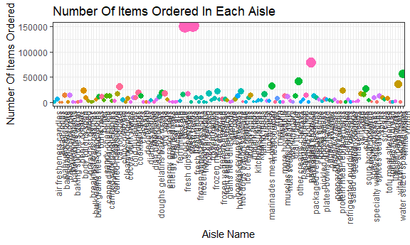

p8105\_hw3\_as5457
================
Sunny Siddique
October 8, 2018

Setting global settings for the format of the graphs generated for this homework.

``` r
#Loading the tidyverse package. 
library(tidyverse)
```

    ## -- Attaching packages -------------------------------------------------------------------------------- tidyverse 1.2.1 --

    ## v ggplot2 3.0.0     v purrr   0.2.5
    ## v tibble  1.4.2     v dplyr   0.7.6
    ## v tidyr   0.8.1     v stringr 1.3.1
    ## v readr   1.1.1     v forcats 0.3.0

    ## -- Conflicts ----------------------------------------------------------------------------------- tidyverse_conflicts() --
    ## x dplyr::filter() masks stats::filter()
    ## x dplyr::lag()    masks stats::lag()

``` r
library(ggridges)
```

    ## 
    ## Attaching package: 'ggridges'

    ## The following object is masked from 'package:ggplot2':
    ## 
    ##     scale_discrete_manual

``` r
#Ensuring that the generated graphs are of reasonable height and width.
knitr::opts_chunk$set(
  fig.width = 6,
  fig.asp = .6,
  out.width = "90%"
)

#Ensuring that the background of the graphs are bw and legend is printed at the bottom. 
theme_set(theme_bw() + theme(legend.position = "right"))
```

------------------------------------------------------------------------

Problem 1
=========

**Load the BRFSS data**

First, do some data cleaning:

-   Format the data to use appropriate variable names;
-   Focus on the “Overall Health” topic
-   Include only responses from “Excellent” to “Poor”
-   Organize responses as a factor taking levels from “Excellent” to “Poor”

``` r
#Loading the dataset from the p8105.datasets package
library(p8105.datasets)
data("brfss_smart2010")

#Defining a new dataset called brfss_smart from the original dataset
brfss_smart = brfss_smart2010 %>% 
  
#Cleaning variable names
janitor::clean_names(dat = .) %>% 
  
#Keeping only rows where the topic was "Overall Health"
  filter(topic == "Overall Health") %>% 
  
#Including only responses from "Excellent" to "Poor"
  filter(response %in% c("Excellent", "Very good", "Good", "Fair", "Poor")) %>% 
  
#Organizing responses as a factor taking levels from "Excellent" to "Poor"
  mutate(response = forcats::fct_reorder(response, display_order))

#Checking if conversion of the response variable from character to factor worked
class(brfss_smart$response)
```

    ## [1] "factor"

**Using this dataset, do or answer the following (commenting on the results of each):**

-   In 2002, which states were observed at 7 locations?

*The states that were observed at 7 locations were CT, FL, NC.*

``` r
brfss_smart %>%
  
#Filtering to only keep data for 2002
  filter(year == 2002) %>% 
  
#Separating locationdesc to be able to count distinct state and county
  separate(locationdesc, into = c("state", "county"), sep = " - ") %>% 
  distinct(state, county) %>% 
  
#Counting number of states represented
  count(state) %>% 
  
#Filtering states that were observed 7 times
  filter (n == 7)
```

    ## # A tibble: 3 x 2
    ##   state     n
    ##   <chr> <int>
    ## 1 CT        7
    ## 2 FL        7
    ## 3 NC        7

-   Make a “spaghetti plot” that shows the number of observations in each state from 2002 to 2010.

``` r
#Making spaghetting plot called "Spaghetti"
spaghetti = brfss_smart %>% 
  
#Grouping by the year and state abbreviation variables.
  group_by (year, locationabbr) %>% 
  
#Counting the number of times the state variable is observed
  summarize (n = n()) %>% 
  
#Setting up ggplot to show the spaghetti plot with points and lines connected.
  ggplot(aes(x = year, y = n, color = locationabbr)) +
  geom_point() +
  geom_line() + 
  labs (
    title = "Number of Observations in Each State by Year",
        x = "year",
        y = "number of observations"
  )

#Viewing the spaghetti plot
spaghetti
```


-   Make a table showing, for the years 2002, 2006, and 2010, the mean and standard deviation of the proportion of “Excellent” responses across locations in NY State.

``` r
#Filtering to only keep data for the years 2002, 2006 and 2010
year02 = brfss_smart %>% 
  filter (year == 2002)
year06 = brfss_smart %>%
  filter (year == 2006)
year10 = brfss_smart %>% 
  filter (year == 2010)

#Combining the year-filtered datasets into one dataset
filteredyear = bind_rows(year02, year06, year10)

#Continuing to filter variables
filteredyear %>% 
  
#Filtering data for NY
  filter(locationabbr == "NY") %>% 
  
#Filtering data for those who responded "Excellent"
  filter(response == "Excellent") %>% 
  
#Grouping by year variable
  group_by(year) %>% 
  
#Calculating mean and standard deviation
  summarize(mean_prop = mean(data_value),
            std_prop = sd(data_value))
```

    ## # A tibble: 3 x 3
    ##    year mean_prop std_prop
    ##   <int>     <dbl>    <dbl>
    ## 1  2002      24.0     4.49
    ## 2  2006      22.5     4.00
    ## 3  2010      22.7     3.57

-   For each year and state, compute the average proportion in each response category (taking the average across locations in a state). Make a five-panel plot that shows, for each response category separately, the distribution of these state-level averages over time.

``` r
#First I am converting the year variable from "integer" to "Factor" to be able to make my boxplot show each year.
brfss_smart$year=as.factor(brfss_smart$year)
```

``` r
brfss_smart %>% 
  
#Grouping by the response, locationabbr, year variables
  group_by (response, locationabbr, year) %>% 
  
#Calculating the mean for each response value.
  summarize(avg_prop = mean (data_value)) %>% 
  
#Setting up boxplot using ggplot.
  ggplot(aes(x = year, y = avg_prop)) + 
  geom_boxplot(alpha = .5) +
  facet_grid(. ~ response) +
  labs (
    title = "Distribution of State-Level Averages Over Time",
        x = "Year",
        y = "Average Proportion"
  ) + theme(axis.text.x = element_text(angle = 90, hjust = 1))
```

    ## Warning: Removed 21 rows containing non-finite values (stat_boxplot).


Problem 2
=========

Importing the instacart data

``` r
#Loading the dataset from the p8105.datasets package
library(p8105.datasets)
data("instacart")

#Defining a new dataset called brfss_smart from the original dataset
insta = instacart %>% 
  
#Cleaning variable names
janitor::clean_names(dat = .)
```

The goal is to do some exploration of this dataset. To that end, write a short description of the dataset, noting the size and structure of the data, describing some key variables, and giving illstrative examples of observations.

The instacart dataset provides information regarding each individual order that was placed and the products that were ordered. Additionally, it contains information regarding where in the supermarket (aisle) the ordered products can be found. The dataset size is \[1,384,617 x 15\] with rows containing repeated informmation regarding each order and columns showing important variables such as the Order ID, Product Name, Time of the Order, Location and Department of the Order etc. There are 131209 distinct customers who collectively ordered 39123 orders.

**How many aisles are there, and which aisles are the most items ordered from?**

*There are 134 aisles.*

``` r
#Counting the number of unique aisles using the unique and length function.
unique_aisle = unique(insta$aisle_id)
length(unique_aisle)
```

    ## [1] 134

*The aisles with the most items ordered are: fresh vegetables, fresh fruits, packaged vegetables & fruits, yogurt and packaged cheese.*

``` r
insta %>%

#Collapsing the aisle variable
  group_by(aisle) %>% 
  
#Counting the number of items by each aisle.
  summarize(item_count = n()) %>% 
  
#Arranging the output in descending order to find the most items ordered.
  arrange(desc(item_count))
```

    ## # A tibble: 134 x 2
    ##    aisle                         item_count
    ##    <chr>                              <int>
    ##  1 fresh vegetables                  150609
    ##  2 fresh fruits                      150473
    ##  3 packaged vegetables fruits         78493
    ##  4 yogurt                             55240
    ##  5 packaged cheese                    41699
    ##  6 water seltzer sparkling water      36617
    ##  7 milk                               32644
    ##  8 chips pretzels                     31269
    ##  9 soy lactosefree                    26240
    ## 10 bread                              23635
    ## # ... with 124 more rows

**Make a plot that shows the number of items ordered in each aisle. Order aisles sensibly, and organize your plot so others can read it.**

``` r
insta %>%
  
#Collapsing by the aisle and department variables
  group_by(aisle, department) %>% 
  
#Counting the number of items by aisle and department.
  summarize(item_count = n()) %>% 
  
#Creating a scatterplot
  ggplot(aes(x = aisle, y = item_count, color = department)) + 
  geom_point(aes(size = item_count), alpha = 1) +
  labs (
    title = "Number Of Items Ordered In Each Aisle",
        x = "Aisle Name",
        y = "Number Of Items Ordered"
  ) + theme(axis.text.x = element_text(angle = 90, hjust = 1), legend.position = "none")
```



The legend of the plot above can be more easily seen below. (The size of each bubble represents the frequency of products and color represents department)

``` r
insta %>%
  group_by(aisle, department) %>% 
  summarize(item_count = n()) %>% 
  ggplot(aes(x = aisle, y = item_count, color = department)) + 
  geom_point(aes(size = item_count), alpha = 1) +
  labs (
    title = "Number Of Items Ordered In Each Aisle",
        x = "Aisle Name",
        y = "Number Of Items Ordered"
  ) + theme(axis.text.x = element_text(angle = 90, hjust = 1), legend.position = "right")
```


**Make a table showing the most popular item in each of the aisles “baking ingredients”, “dog food care”, and “packaged vegetables fruits”.**

``` r
insta %>% 
  
#Grouping by the aisle and product name variables.
  group_by(aisle, product_name) %>% 
  
#Counting the number of items by aisle and product name. 
  summarize (item_counts = n()) %>% 
  
#Creating ranks in descending orders from most popular to least popular.
  mutate(rank = min_rank(desc(item_counts))) %>% 
  
#Keeping only the most popular item. 
  filter (rank == 1) %>% 
  
#Keeping on the three specified aisles. 
  filter(aisle %in% c("baking ingredients", "dog food care", "packaged vegetables fruits"))
```

    ## # A tibble: 3 x 4
    ## # Groups:   aisle [3]
    ##   aisle               product_name                       item_counts  rank
    ##   <chr>               <chr>                                    <int> <int>
    ## 1 baking ingredients  Light Brown Sugar                          499     1
    ## 2 dog food care       Snack Sticks Chicken & Rice Recip~          30     1
    ## 3 packaged vegetable~ Organic Baby Spinach                      9784     1

**Make a table showing the mean hour of the day at which Pink Lady Apples and Coffee Ice Cream are ordered on each day of the week; format this table for human readers (i.e. produce a 2 x 7 table).**

``` r
insta %>% 
  
#Grouping by the product name and the day of the week when the product was ordered. 
  group_by(product_name, order_dow) %>% 
  
#Calculating the mean hour of the day at which the order was placed. 
  summarize(mean_hour_day = mean(order_hour_of_day)) %>% 
  
#Keeping only the two specified items. 
  filter(product_name %in% c("Pink Lady Apples", "Coffee Ice Cream")) %>% 
  
#Spreading the table.
  spread(key = "order_dow", value = "mean_hour_day") %>% 
  
#Formatting the output as a table.
  knitr::kable()
```

| product\_name    |         0|         1|         2|         3|         4|         5|         6|
|:-----------------|---------:|---------:|---------:|---------:|---------:|---------:|---------:|
| Coffee Ice Cream |  13.77419|  14.31579|  15.38095|  15.31818|  15.21739|  12.26316|  13.83333|
| Pink Lady Apples |  13.44118|  11.36000|  11.70213|  14.25000|  11.55172|  12.78431|  11.93750|

Problem 3
=========

This problem uses the NY NOAA data. DO NOT include this dataset in your local data directory; instead, load the data from the p8105.datasets package (it’s called ny\_noaa).

``` r
#Loadin the NY NOAA dataset from the p8105.datasets package and calling it "weather". 
library(p8105.datasets)
data("ny_noaa")
weather = ny_noaa %>% 
  janitor::clean_names(dat = .)
```

**The goal is to do some exploration of this dataset. To that end, write a short description of the dataset, noting the size and structure of the data, describing some key variables, and indicating the extent to which missing data is an issue.**

The NY NOAA dataset provides information regarding the weather and precipitation pattern from 1981-01-01 to 2010-12-31. The size of the dataset is \[2,595,176 x 7\] and data are structured with columns providing information on precipitation (rain/snow) and daily temperatures (tmin/tmax). These key variables allow us to analyze the weather patterns in NY over the past decade. There are 145838 missing values for the precipitation colummn and 1134358 missing values for tmax and 1134420 missing values for tmin. Since a large extent of the data are missing, this might be an issue in the analysis of this dataset because we would only be able to restrict our analysis to the specific stations for which data are available.

**Do some data cleaning. Create separate variables for year, month, and day. Ensure observations for temperature, precipitation, and snowfall are given in reasonable units.**

``` r
#Creating a new clean dataset called ny_weather
ny_weather <- weather %>% 
  
#Creating varaibles year, month and day using the date variable. 
  separate(date, into = c("year", "month", "day"), sep = "-") %>%
  
#Precipitation was reported as tenth of mm, therefore dividing it by 10. 
  mutate(prcp = prcp / 10) %>% 
  
#tmax and tmi=n were reported as tenth of degree, therefore dividing them by 10. 
  mutate(tmax = as.numeric(tmax) / 10) %>% 
  mutate(tmin = as.numeric(tmin)/10)
```

**For snowfall, what are the most commonly observed values? Why?**

The most common values observed for snowfall are 0 and null. This is because most days of the year it does not snow and many stations do not collect information on snow.

``` r
ny_weather %>% 

#Counting the number of snow days and arranging in descending order. 
  count(snow) %>% 
  arrange(desc(n))
```

    ## # A tibble: 282 x 2
    ##     snow       n
    ##    <int>   <int>
    ##  1     0 2008508
    ##  2    NA  381221
    ##  3    25   31022
    ##  4    13   23095
    ##  5    51   18274
    ##  6    76   10173
    ##  7     8    9962
    ##  8     5    9748
    ##  9    38    9197
    ## 10     3    8790
    ## # ... with 272 more rows

**Make a two-panel plot showing the average max temperature in January and in July in each station across years. Is there any observable / interpretable structure? Any outliers?**

Observing the collection of box plots below, we can see that in general, the average tmax in January is significantly lower in January than in July (as expected). The median of the mean tmax in January mostly falls beetween -5C and +5C whereas in July the values approximately range between 25C and 30C. There are many outliers in the January plot on both ends of the boxplots. In the July plot, however, the outliers are all in the lower tail of the boxplots, meaning that in July tmax can be low for some stations compared to what is expected.

``` r
ny_weather %>% 
  
#Keeping records only the months of January and July. 
  filter (month %in% c("01", "07")) %>%
  
#Grouping by month, station ID and year. 
  group_by(month, id, year) %>% 
  
#Calculating the mean of tmax by month, station ID and year. 
  summarize(average_tmax = mean(tmax, na.rm = TRUE)) %>% 
  
#Creting boxplot to show avereage tmax in January and July by year. 
  ggplot(aes(x = year, y = average_tmax)) +
  geom_boxplot() +
  facet_grid(~month) +
    labs (
    title = "Average Maximum Temperature In January and July",
        x = "Year",
        y = "Average Maximum Temperature (C)"
  ) + theme(axis.text.x = element_text(angle = 90, hjust = 1))
```

    ## Warning: Removed 5970 rows containing non-finite values (stat_boxplot).


**Make a two-panel plot showing (i) tmax vs tmin for the full dataset (note that a scatterplot may not be the best option); and (ii) make a plot showing the distribution of snowfall values greater than 0 and less than 100 separately by year.**

tmax vs tmin for full dataset
=============================

``` r
#Creating a hexagonal plot called "hex" which shows the tmax vs tmin for the full dataset. 
hex = ny_weather %>% 
  ggplot(aes(x = tmax, y = tmin)) +
  geom_hex() +
  labs(
    title = "Tmax/Tmin Hexagon Plot",
    x = "Maximum Temperature",
    y = "Minimum Temperature"
  ) + theme (legend.position = "bottom")

#Creating a ridge plot that shows the distribution of snowfall values separated by year. 
snowfall = ny_weather %>% 
  filter(snow > 0 & snow < 100) %>% 
  ggplot(aes(x = snow, y = year)) + 
  geom_density_ridges(scale = .85) +
  labs(
    title = "Snowfall Distribution",
    x = "Snowfall (mm)",
    y = "Year"
  )

#Stitching together the two plots
library(gridExtra)
```

    ## 
    ## Attaching package: 'gridExtra'

    ## The following object is masked from 'package:dplyr':
    ## 
    ##     combine

``` r
grid.arrange(hex, snowfall, nrow = 1)
```

    ## Warning: Removed 1136276 rows containing non-finite values (stat_binhex).

    ## Picking joint bandwidth of 3.76


